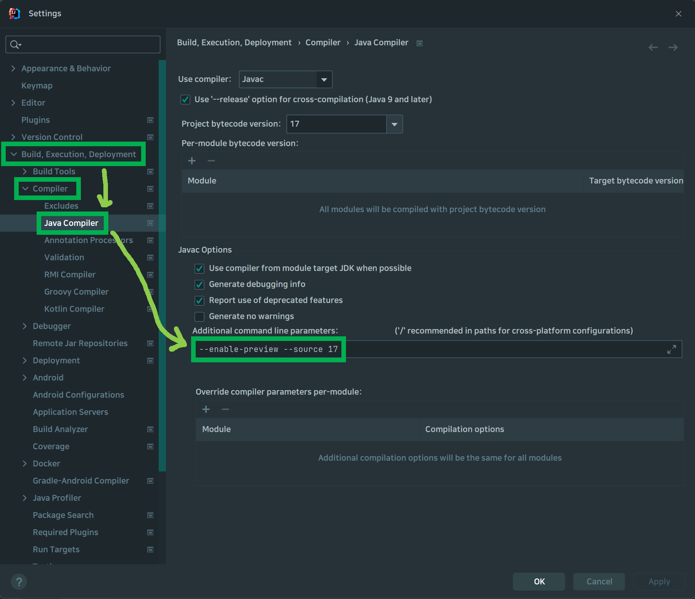
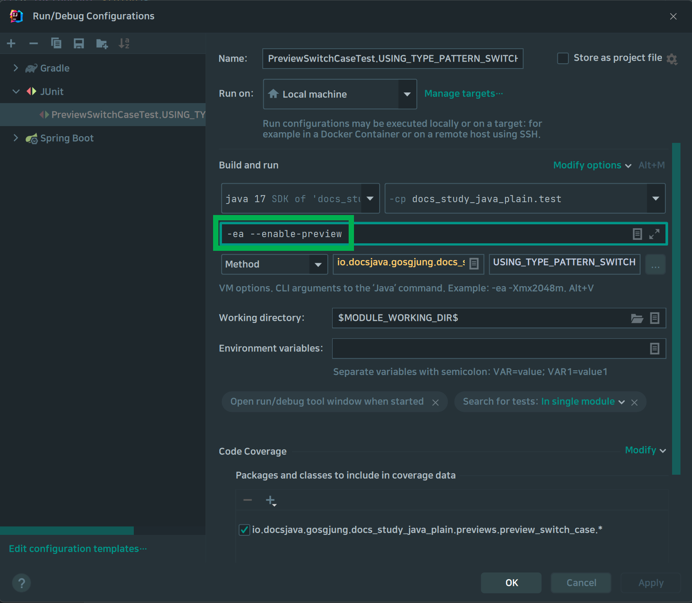

# Java 8 이후의 새로운 문법들
{: .no_toc }
<br>
<br>


## Table of contents
{: .no_toc .text-delta }

1. TOC
{:toc}

---

<br>

### 참고자료
{: .fs-6 .fw-700 }
- [Java 14 Record Keyword](https://www.baeldung.com/java-record-keyword)
- [https://www.baeldung.com/java-switch-pattern-matching](https://www.baeldung.com/java-switch-pattern-matching)
<br>


### Java 16
{: .fs-6 .fw-700 }

#### Record
{: .fs-5 .fw-700 }

> 참고자료 : [Java 14 Record Keyword](https://www.baeldung.com/java-record-keyword)

<br>

- Java 14 에서부터 Preview로 제공되다가 Java 16 에서 확정된 기능
- eqauls(), hashCode(), toString() 가 기본으로 제공된다.
- JPA를 사용한다면, 최소 protected 레벨의 기본생성자가 필요하기에 Entity로 사용하기에는 부적합
- 웹 요청에 대한 Request 객체로 사용하기에 적합한 편
- 모든 멤버필드가 private final 로 선언된다.
<br>
<br>

```java
package io.study.gosgjung.layering_docker_image279.record;

import java.time.OffsetDateTime;

// record 클래스는 final 클래스다. 상속이 불가능하다.
// 멤버필드를 생성자에 명시하는 구조다. 정의 즉시 모든 필드에 대한 생성자가 정의된다.
public record Ticker(
    // 멤버필드는 명시하지 않아도 private final 필드로 정의된다.
    String ticker,
    OffsetDateTime updatedDt
) {

    // static 메서드, static 변수를 가질 수 있다.
    private static final String VERSION = "1";

    public static String getVersion(){
        return VERSION;
    }

    // 유효성 체크 로직들을 이곳에 추가가능하다.
    public Ticker {
        if(ticker == null) throw new IllegalArgumentException("ticker 는 비어있을 수 없습니다.");
        if(updatedDt == null) throw new IllegalArgumentException("수정일자 는 비어있을 수 없습니다.");
    }
}
```

<br>
위 코드를 테스트해보면...<br>

**TickerTest.java**
```java
package io.study.gosgjung.layering_docker_image279.record;

import org.junit.jupiter.api.Test;

import java.time.OffsetDateTime;

public class TickerTest {

    @Test
    public void TICKER_TEST(){
        Ticker t = new Ticker("TSLA", OffsetDateTime.now());

        // getter 는 아래와 같이 '필드명()' 과 같은 형식으로 생성된다.
        System.out.println(t.ticker());

        // static 메서드 호출
        System.out.println(Ticker.getVersion());
    }
}
```
<br>
<br>

출력결과
```plain
TSLA
1
```
<br>
<br>

### Java 17
{: .fs-6 .fw-700 }

#### Sealed Class
{: .fs-5 .fw-700 }

코틀린의 sealed class 와 거의 유사한 클래스. [JEP 409](https://openjdk.org/jeps/409) 를 보면  Preview, Second Preview 를 거쳐온 것을 확인 가능하다.

##### java 17 이전에는 확장을 제한할 때 final 을 사용
{: .fs-5 .fw-700 }

```java
class Employee{

}

// ParttimeJob 클래스는 확장이 불가
final class ParttimeJob extends Employee{
}

// FulltimeJob 클래스는 확장이 불가
final class FulltimeJob extends Employee{

}
```
<br>
<br>

##### Java 17 의 sealed 
{: .fs-5 .fw-700 }

###### sealed 란?
{: .fs-5 .fw-700 }
- sealed 키워드는 interface, class 모두에 적용 가능하다.
- sealed 를 클래스 앞에 붙이면 상속(확장)을 못하도록 막을수 있다. 
- sealed 가 붙은 클래스여도 permits 를 통해 상속(확장)할 수 있는 클래스를 지정할 수 있다. 즉 특정 클래스에 대해서만 상속(확장)을 허용하도록 지정하는 것이 가능하다.

<br>

###### sealed 적용시 제한 점들
{: .fs-5 .fw-700 }

- sealed 클래스는 같은 패키지 내의 다른 클래스들에 대해서만 permits 를 지정할 수 있다.
- sealed 클래스에서 permits 가 적용된 클래스는 반드시 해당 sealed class 를 상속(확장)해야 컴파일 오류가 나지 않는다.
- sealed 클래스에서 permits 가 적용된 클래스는 자기 자신을 sealed, non-sealed 로 할지 둘중 하나를 선택하거나, final 로 상속(확장)이 불가능하도록 지정해야 한다.
  - final 로 적용하면 어떠한 클래스든 상속(확장)이 불가능해진다.
  - sealed 로 적용해서, 특정 클래스를 permits 하거나 봉인클래스로 둘 수 있다.
  - non-sealed 를 적용해서 어떠한 클래스든 상속받을 수 있도록 지정할 수 있다.
<br>

###### 예제
{: .fs-5 .fw-700 }

```java
@Getter
public sealed class Fruit permits Apple, Banana, Berry{
    private final String name;

    public Fruit(String name){
        this.name = name;
    }

}

public non-sealed class Apple extends Fruit{
    public Apple(String name){
        super(name);
    }
}

public final class Banana extends Fruit{
    public Banana(String name){
        super(name);
    }
}

public sealed class Berry extends Fruit permits BlueBerry, BlackBerry{
    public Berry(String name){
        super(name);
    }
}

public final class BlackBerry extends Berry{
    public BlackBerry(String name){
        super(name);
    }
}

public final class BlueBerry extends Berry{
    public BlueBerry(String name){
        super(name);
    }
}
```


#### switch, case (Preview)
{: .fs-5 .fw-700 }

Preview 여서 정리안하려 했지만, 미리 정리해두고 다음버전 자바 중 정식 릴리즈 되는 버전 있으면 그곳에 추가 예정.

참고자료
- [https://www.baeldung.com/java-switch-pattern-matching](https://www.baeldung.com/java-switch-pattern-matching)


##### 참고) intellij 에서 Java Preview 기능 Enable

<br>


<br>


##### 참고) java 14 instance of Pattern matching
{: .fs-4 .fw-700 }
type 을 패턴으로 하는 Type Pattern 을 사용하면 Java의 instanceof 를 간소화할 수 있다.

instanceof 를 Pattern Matching 구문에서 사용하는 것은 Java 16 의 Permanenet 피처다.

하지만 아직은 preview 이기에, enable 하기 위해서는 아래의 옵션을 추가해줘야 한다.

또한 Pattern Matching 기능 자체가 Java 17 에서도 Preview 상태이기에 아래의 환경변수들을 실행환경에 추가해줘야 한다.

```bash
java --enable-preview --source 17 PatternMatching.java
```
<br>


예제 

```java
@Test
public void JAVA14_PATTERN_MATCHING(){
//        Object o1 = "Hello";
    Object o1 = 111;

    if(o1 instanceof String s){
        System.out.println("문자열 타입이군.");
    }
    else if(o1 instanceof Number n){
        System.out.println("숫자네??");
    }

}
```


출력결과

```plain
숫자네??
```

<br>


##### Switch 에 Expression 을 사용할 수 있다.
{: .fs-4 .fw-700 }

```java
@Test
public void TEST1(){
    final String b = "B";
    String input1 = "A";
    String input2 = "B";

    switch (input2) {
        case "A" -> System.out.println("Parameter is A");
        case b -> System.out.println("Parameter is B");
        default -> System.out.println("unknown");
    }
}
```

<br>


##### instanceof 조건식을 case 문에서 Type Pattern 으로 치환해서 사용가능
{: .fs-4 .fw-700 }

예를 들어 아래의 if ~ else 가 있다고 해보자.

```java
@Test
public void LEGACY_INSTANCE_OF_WITH_IF_ELSE(){
    double result;
    Object o = 100/3.0f;

    if(o instanceof Integer){
        result = ((Integer) o).doubleValue();
    }
    else if(o instanceof Float){
        result = ((Float) o).doubleValue();
    }
    else if(o instanceof String){
        result = Double.parseDouble((String)o);
    }
    else{
        result = 0d;
    }

    System.out.println("result = " + result);
}
```

<br>


Type Pattern 이라는 것을 사용하면 `o instanceof Integer` , `o instanceof Float`, `o instanceof String` 과 같은 표현식은 아래와 같이 switch case 구문의 case 구문에 Type Pattern 이라고 부르는 표현식으로 바꿔서 치환이 가능하다.

```java
@Test
public void USING_TYPE_PATTERN_SWITCH(){
    Object o = 1000/3.f;
    Double d = switch (o){
        case Integer i -> i.doubleValue();
        case Float f -> f.doubleValue();
        case String s -> Double.parseDouble(s);
        default -> 0d;
    };

}
```

<br>


##### 조건식 여러개 조합 가능 (1)
{: .fs-4 .fw-700 }

> 참고했던 자료인 [baeldung.com/java-switch-pattern-matching](https://www.baeldung.com/java-switch-pattern-matching) 에서는 이런 조건식을 [Guarded Pattern](https://www.baeldung.com/java-switch-pattern-matching#2-guarded-pattern) 이라는 개념으로 설명한다.

<br>

아래 그림처럼 여러개의 if else if 의 조건식들을 case 문에서 사용하고 있다고 해보자.

```java
@Test
public void EXPRESSION_BEFORE(){
    double result;
    Object o = 100/3.0f;

    result = switch (o){
        case String s -> {
            if(s.length() > 0){
                yield Double.parseDouble(s);
            }
            else{
                yield 0d;
            }
        }
        default -> 0d;
    };

    System.out.println("result = " + result);
}
```

<br>


위 구문은 아래 그림처럼 필요한 조건식끼리 서로 결합해서 압축할 수 있다.

```java
@Test
public void EXPRESSION_AFTER(){
    double result;
    Object o = 100/3.0f;

    result = switch (o){
        case String s && s.length() > 0 -> Double.parseDouble(s);
        default -> 0d;
    };

    System.out.println("result = " + result);
}
```

<br>


##### 조건식 여러개 조합가능 (2)
{: .fs-4 .fw-700 }

> 참고했던 자료인 [baeldung.com/java-switch-pattern-matching](https://www.baeldung.com/java-switch-pattern-matching) 에서는 이런 조건식을 [Parenthesized Pattern](https://www.baeldung.com/java-switch-pattern-matching#3-parenthesized-pattern) 이라는 개념으로 설명한다.

위의 예제는 아래와 같은 조건식을 `&&` 로 덧대어서 또 하나의 조건식을 추가하는 것이 가능하다.

Pattern Matching for Switch 기능에서는 Switch 구문 내에 여러개의 조건식을 추가할 수 있게 되었다.

다시한번 정리하지만 Pattern Matching for Switch 기능은 아직 Preview 이기에 운영에서 사용하기에는 불안정한 기능이다. 문법적인 요소를 스터디하기 위해 정리하고 있는 중이다.

```java
@Test
public void EXPRESSION_AFTER_ONE_MORE(){
    double result;
    Object o = 100/3.0f;

    result = switch (o){
        case String s && s.length() > 0 && !(s.contains("$") || s.contains("#"))-> Double.parseDouble(s);
        default -> 0d;
    };

    System.out.println("result = " + result);
}
```

<br>

##### default 누락할 경우
{: .fs-4 .fw-700 }

switch 로 들어오는 나머지 경우(other 케이스)를 모두 커버하지 못할 경우 컴파일 에러를 낸다.
예를 들어 아래 구문은 default 구문으로 other 케이스에 대한 처리가 없다.
따라서 에러가 발생할 소지가 있는데 Java 컴파일러는 이것을 파악해 컴파일 에러를 낸다.

```java
static double getDoubleUsingSwitch(Object o) {
    return switch (o) {
        case String s -> Double.parseDouble(s);
    };
}
```

<br>

예를 들면 아래와 같은 에러가 나타난다.
```plain
[ERROR] Failed to execute goal ... on project core-java-17: Compilation failure
[ERROR] /D:/Projects/.../HandlingNullValuesUnitTest.java:[10,16] the switch expression does not cover all possible input values
```

<br>

##### Ordering Subclasses
{: .fs-4 .fw-700 }

switch \~ case 구문이 타입을 패턴 매칭해서 경우의 수를 분류할 때 구분할 타입의 경계가 모호하면 에러를 낸다.
예를 들면 아래 예제는 입력값인 `Object o` 가 문자열 인풋으로 들어올 경우 CharSequence 으로 판단할지 String으로 판단할지 모호하다. 그래서 에러를 내게 된다.

```java
static double getDoubleUsingSwitch(Object o) {
    return switch (o) {
        case CharSequence c -> Double.parseDouble(c.toString());
        case String s -> Double.parseDouble(s);
        default -> 0d;
    };
}
```

<br>

에러 문구
```plain
[ERROR] Failed to execute goal ... on project core-java-17: Compilation failure
[ERROR] /D:/Projects/.../HandlingNullValuesUnitTest.java:[12,18] this case label is dominated by a preceding case label
```

<br>

##### Handling Null Values
{: .fs-4 .fw-700 }

옛날 버전의 Java 에서는 switch case 에 null 값이 전달되면 NullPointException 이 발생한다.
자바의 Type Pattern 을 사용하면, null 체크 역시 case 문으로 분리해서 진행하는 것이 가능하다.
```java
static double getDoubleUsingSwitch(Object o) {
    return switch (o) {
        case String s -> Double.parseDouble(s);
        case null -> 0d;
        default -> 0d;
    };
}
```

<br>

