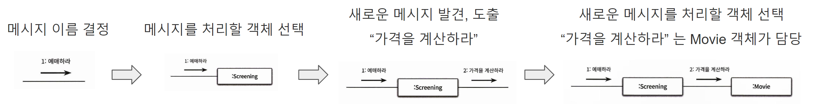
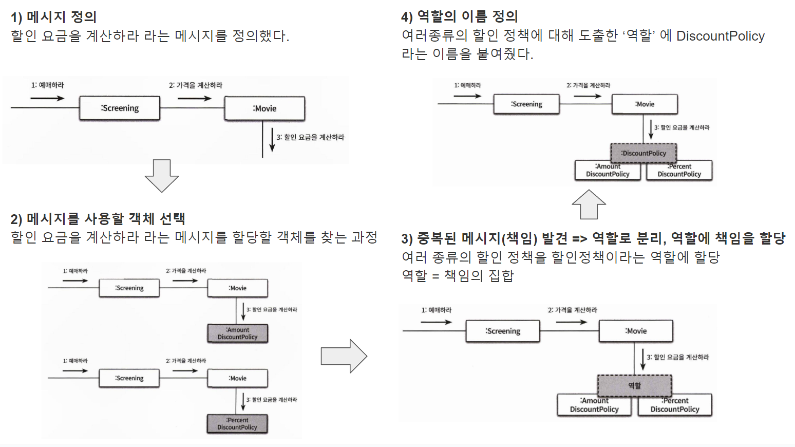

# 3. 협력, 책임, 역할
{: .no_toc }
<br>


## Table of contents
{: .no_toc .text-delta }

1. TOC
{:toc}

---

<br>

### 참고자료
{: .fs-6 .fw-700 }
- [오브젝트](https://search.shopping.naver.com/book/catalog/32453230352?query=%EC%98%A4%EB%B8%8C%EC%A0%9D%ED%8A%B8%20%EC%A1%B0%EC%98%81%ED%98%B8&NaPm=ct=lgv4bbxs%7Cci=950866afa7fa493589cc2e1f6b8686ab9b67e091%7Ctr=boksl%7Csn=95694%7Chk=b2d3d1acd016fb57260c0abe8e3ce0a6ee8c22ca)

<br>

### 협력, 책임, 역할 이란?
{: .fs-6 .fw-700 }
#### 협력
{: .fs-5 .fw-700 }
어떤 객체가 다른 객체에게 무엇인가를 요청하는 것을 협력이라고 한다.<br>
객체 상의 협력을 설계할 때는 객체를 서로 분리된 인스턴스가 아닌 협력하는 파트너로 인식해야 한다.(Wirfs-Brock03)<br>
협력은 객체를 설계하기 위한 구체적인 문맥을 제공한다.<br>
협력은 책임을 이끌어내고, 책임이 협력에 참여할 객체를 결정한다.<br>
<br>

e.g.
- Screening 은 Movie 객체에 메시지를 전송한다.
- Screening 은 Movie 객체와 협력하고 있다.

<br>

#### 책임
{: .fs-5 .fw-700 }
협력에 참여하기 위해 객체가 수행하는 행동을 책임이라고 부른다.<br>
책임은 객체가 어떤 행동을 해야할 지를 사람의 화법으로 표현한 것이다.<br>
- 참고) 책임할당, 책임주도설계, 책임과 협력

<br>

#### 역할
{: .fs-5 .fw-700 }
역할은 책임의 집합을 의미한다.<br>
여러 종류의 책임은 하나의 역할로 추상화할 수 있다.<br>
어떤 책임(메시지)가 여러 종류의 객체에서 사용된다면, 이 여러 종류의 책임 객체들을 역할로 분류한다.<br>
책임은 구체(concrete) 개념이고, 역할은 추상(abstract) 개념이다.<br>
여러 종류의 책임에서 공통점을 찾아내서 역할이라는 추상클래스/인터페이스로 분류할 수 있다.<br>

<br>

e.g. 책임
- 금액할인(AmountDiscountPolicy), 비율할인(PercentDiscountPolicy), 무할인(NoneDiscountPolicy) 객체들에 공통적으로 존재하는 calculateDiscountAmount() 메서드 

<br>

e.g. 역할
- DiscountPolicy
- AmountDiscountPolicy, PercentDiscountPolicy, NoneDiscountPolicy 객체에 대해 DiscountPolicy 라는 이름의 하나의 역할 클래스로 정의한다.

<br>

### 협력
{: .fs-6 .fw-700 }

#### 협력 설계 시 거치는 주요 원칙
{: .fs-5 .fw-700 }

**1) 객체는 자신의 일을 스스로 처리할 수 있는 자율적인 존재여야 한다.**<br>
- Movie 객체는 자율적인 존재가 되기 위해서는 요금 계산을 스스로 처리할 수 있어야 한다.

<br>

**2) 협력이 설계를 위한 문맥을 제공한다.**<br>
- 상태, 행동을 정의하면서 협력관계가 도출되고 객체를 설계하는 데에 있어서 필요한 문맥(Context)가 도출된다.

<br>

**3) 객체를 자율적으로 만드는 가장 기본적인 방법은 내부 구현을 캡슐화하는 것이다.**<br>
e.g. <br>

Screening 이 Movie, DiscountPolicy, Screening 같은 캡슐화된 객체를 통해 Screening 의 역할을 수행하고, 캡슐화 된 Movie, DiscountPolicy, Screening 역시 외부에 영향없이 자율적으로 역할을 수행

<br>

##### 1) 객체는 자신의 일을 스스로 처리할 수 있는 자율적인 존재여야 한다.
{: .fs-5 .fw-700 }

Movie 객체는 영화 요금 계산을 자율적으로 처리할 수 있다.
자신이 할 수 없는 할인요금 계산은 DiscountPolicy 에 위임해 할인 금액을 얻어온다. 
다른 코드의 상수 코드나 상태에 종속적이지 않다. 필요한 다른 계산, 처리는 객체에 위임해서 얻어오고 자신의 역할을 한다.

```java
public class Movie{
	private Money fee;	// 생성자 주입
	private DiscountPolicy discountPolicy; 	// 생성자 주입

	// ...

	public Money calculateMovieFee(Screening screening){
		return fee.minus(discountPolicy.calculateDiscountAmount(screening));
	}
}
```

<br>

##### 2) 협력이 설계를 위한 문맥을 제공한다. (상태, 행동, 협력관계)
{: .fs-5 .fw-700 }

- 상태, 행동을 정의하면서 협력관계가 도출되고 객체를 설계하는 데에 있어서 필요한 문맥(Context)가 도출된다.

**상태**란 객체가 어떤 행동을 하는 데에 필요한 정보다.<br>
**행동**은 협력 내에서 객체가 처리할 메시지다.<br>

협력 설계시 상태, 행동을 고려해 설계를 하면 협력을 통해 행동을 하게 되고, 행동은 상태를 필요로 한다.

협력관계를 통해서 객체를 설계하는 데에 있어서 필요한 문맥(Context)가 도출된다.

<br>

##### 3) 객체를 자율적으로 만드는 가장 기본적인 방법은 내부 구현을 캡슐화하는 것이다. 
{: .fs-5 .fw-700 }

자율적인 객체를 만드는 가장 기본적인 방법은 내부 구현을 캡슐화하는 것이다. 이렇게 캡슐화를 통해 변경으로 인한 파급효과(Side Effect)를 줄일 수 있다.

```java
public class Movie{
	private Money fee; // 생성자 주입
	private DiscountPolicy discountPolicy; // 생성자 주입

	// ...

	public Money calculateMovieFee(Screening screening){
		return fee.minus(discountPolilcy.calculateDiscountAmount(screening));
	}
}
```

<br>

### 책임
{: .fs-6 .fw-700 }

협력에 참여하기 위해 객체가 수행하는 행동을 책임이라고 부른다.<br>
책임은 객체가 어떤 행동을 해야할 지를 사람의 화법으로 표현한 것이다.<br>
**“책임을 수행한다.”** 는 말은 **“메시지를 전송한다.”** 라는 말로도 표현된다.<br>
- 참고) 책임할당, 책임주도설계, 책임과 협력

<br>

#### 책임할당
{: .fs-5 .fw-700 }

책임을 할당하는 것은 메시지의 이름을 결정하는 것과 같다.<br>

책임할당 과정에서는 아래의 두 과정을 끊임없이 반복한다.<br>
- 메시지의 이름을 결정한다. (책임에 대한 이름을 짓는다.)
- 메시지를 처리할 객체를 결정한다. (책임을 수행할 객체를 선택)

<br>



<br>

#### 책임주도 설계 (RDD, Responsibility-Driven Design)
{: .fs-5 .fw-700 }

책임을 찾고 책임을 수행할 적절한 객체를 찾아서 책임을 할당하는 방식으로 협력을 설계하는 방식을 책임주도 설계(Responsibility-Driven Design, RDD) 라고 부른다.<br>
- e.g. Movie 객체는 자율적인 존재가 되기 위해서는 요금 계산을 스스로 처리할 수 있어야 한다.<br>

<br>

책임주도 설계는 자연스럽게 객체의 구현이 아닌 책임에 집중할 수 있게 한다.<br>
- 처음부터 객체를 구현해나가면서 리팩토링하는 것이 아니라 기능의 리스트업을 통해 세부적인 메시지를 정의하고
 이것을 수행할 객체를 선택하는 과정을 거친다. 이렇게 하면 결국 책임을 기반으로 결정을 하게 된다.

<br>

#### 책임할당할 객체 선택 시 주요 원칙
{: .fs-5 .fw-700 }

**1) 메시지가 객체를 결정한다.**
- 메시지가 객체를 결정하게 해야 한다. 객체가 메시지를 결정하게 하는 것이 아니다.
- 메시지가 객체를 결정하게끔 하면, 아래의 두 장점을 얻는다.
  - 객체가 최소한의 인터페이스를 갖게된다.
  - 추상적인 인터페이스를 가질 수 있게 된다.
<br>

**2) 행동이 상태를 결정한다. 행동이 객체의 책임이 되어야 한다.**
- 객체는 협력에 필요한 행동을 제공해야 한다. 객체의 상태가 아닌 행동이 중요하다. (객체의 상태는 행동이 결정되어야 상태가 결정된다.) 
- 객체의 행동이 아닌 상태에 초점을 맞출 경우 캡슐화가 저해되는 결과를 낳는다.
  - 행동이 아닌 상태에 초점을 맞추는 실수(상태를 먼저 결정하고 행동을 결정)를 유의해야 한다.
  - 객체의 상태에 초점을 맞춰 구현을 하면 내부 구현이 퍼블릭 인터페이스로 노출된다. 이때 내부 구현을 변경하면 퍼블릭 인터페이스도 함께 변경된다. 이러면 결국 클라이언트 계층까지 변경의 영향이 전파된다.
- 행동이 상태를 결정하지 않고 상태를 먼저 정의후 행동을 정의하는 방식은 데이터 주도 설계(Data Driven Design)라고 부른다. (레베카 워스트브룩)

<br>

#### 책임주도 설계 (RDD, Responsibility-Driven Design) 를 하는 과정
{: .fs-5 .fw-700 }
- 시스템의 책임을 파악한다. (시스템의 책임은 시스템이 사용자에게 제공해야 하는 기능을 의미)
- 시스템의 책임을 더 작은 책임으로 분할한다.
- 분할된 책임을 수행할 수 있는 적절한 객체/역할을 찾아서 할당한다.
- 객체가 책임을 수행하는 도중 다른 객체의 도움이 필요한 경우 이것을 책임질 적절한 객체/역할을 찾는다.
- 해당 객체 또는 역할에게 책임을 할당하는 것으로 두 객체가 협력하게 한다.

<br>

#### 책임과 협력
{: .fs-5 .fw-700 }

협력 관계 속에서 책임을 도출한다.<br>
책임은 책임을 수행할 객체를 선택해서 메시지를 어떤 객체에서 수행할지를 결정한다.<br>
이렇게 결정한 객체에 대한 책임(메서드)은 다른 객체와 협력관계를 갖는다.<br>
책임을 통해 객체가 행동을 하는데, 행동은 다른 객체와 협력관계를 맺는다. 따라서 협력과 책임은 서로 연관된 개념이다.<br>

<br>

### 역할
{: .fs-6 .fw-700 }

역할은 책임의 집합을 의미한다.<br>
여러 종류의 책임은 하나의 역할로 추상화할 수 있다.<br>
어떤 책임(메시지)가 여러 종류의 객체에서 사용된다면, 이 여러 종류의 책임 객체들을 역할로 분류한다.<br>
책임은 구체(concrete) 개념이고, 역할은 추상(abstract) 개념이다.<br>
여러 종류의 책임에서 공통점을 찾아내서 역할이라는 추상클래스/인터페이스로 분류할 수 있다.<br>

<br>

**e.g. 책임**<br>
- 금액할인(AmountDiscountPolicy), 비율할인(PercentDiscountPolicy), 무할인(NoneDiscountPolicy) 객체들에 공통적으로 존재하는 calculateDiscountAmount()

<br>

**e.g. 역할**<br>
- DiscountPolicy 와 같은 여러 책임들을 추상화할 수 있는 추상화 클래스를 역할 클래스라고 한다.
- AmountDiscountPolicy, PercentDiscountPolicy, NoneDiscountPolicy 객체에 대해 DiscountPolicy 라는 이름의 하나의 역할 클래스로 정의한다.

<br>

#### 역할과 추상화
{: .fs-5 .fw-700 }

역할은 추상화를 이용해 공통의 책임ㅇ르 바탕으로 객체의 종류를 숨긴다.<br>
역할을 사용하면 아래의 두 장점을 갖게 된다. (2장. 추상화 참고)<br>
- 중요한 정책을 추상화해서 상위 수준에서 단순화할 수 있다.
  - 세부 사항에 억눌리지 않고도 상위 수준의 정책을 쉽고 간단하게 표현할 수 있다.
  - e.g. 금액할인 정책, 비율할인 정책을 순번/기간 조건과 조합해 다양한 방식의 요금 규칙을 설정할 수 있게 된다.
- 설계가 조금 더 유연해진다.
  - 다양한 종류의 객체를 끼워넣을 수 있도록 하나의 추상화된 클래스인 DiscountPolicy 를 도입했다는 사실을 기억하자.

<br>

#### 책임에서부터 역할로 분류해가는 과정
{: .fs-5 .fw-700 }

**책임 정의**<br>
객체가 수행하는 행동을 메시지로 정의한다. 이렇게 객체가 수행하는 메시지를 책임 이라고 부른다.<br>

<br>


**역할 도출**<br>
특정 메시지는 특정 상황(e.g. 할인가격 계산)속 에서 특정 객체들이 같은 이름의 메시지를 갖는 경우가 있다.<br>
이렇게 같은 이름의 메시지가 여러 객체에 존재할 때 이것을 공통된 객체 내의 메시지로 추상화를 하는데, 이것을 역할이라고 한다.<br>

<br>

**e.g. 책임**<br>
- 금액할인(AmountDiscountPolicy) 객체의 calculateDiscountAmount()
- 비율할인(PercentDiscountPolicy) 객체의 calculateDiscountAmount()
- 무할인(NoneDiscountPolicy) 객체의 calculateDiscountAmount()

<br>

**e.g. 역할**<br>
- DiscountPolicy 로 추상화
- AmountDiscountPolicy, PercentDiscountPolicy, NoneDiscountPolicy 객체에 대해 DiscountPolicy 라는 이름의 하나의 역할 클래스로 정의하고 DiscountPolicy 클래스는 추상 메서드로 calculateDiscountAmount() 를 갖는다.

<br>

**e.g. 그림으로 정리해보면 아래와 같다.**<br>


<br>

#### e.g. 역할에 책임을 할당한 코드
{: .fs-5 .fw-700 }

DiscountPolicy 는 AmountDiscountPolicy, PercentDiscountPolicy, NoneDiscountPolicy 객체를 대체할 수 있는 추상화 클래스다.

```java
public class Movie{
	
	// ...

	private DiscountPolicy discountPolicy; // 생성자 주입

	public Movie(String title, Duration runningTime, Money fee, DiscountPolicy discountPolicy){
		// ...
		this.discountPolicy = discountPolicy;
	}

	// ...

	public Money calculateMovieFee(Screening screening){
		return fee.minus(
			discountPolicy.calculateDiscountAmount(screening);
		);
	}
}
```
