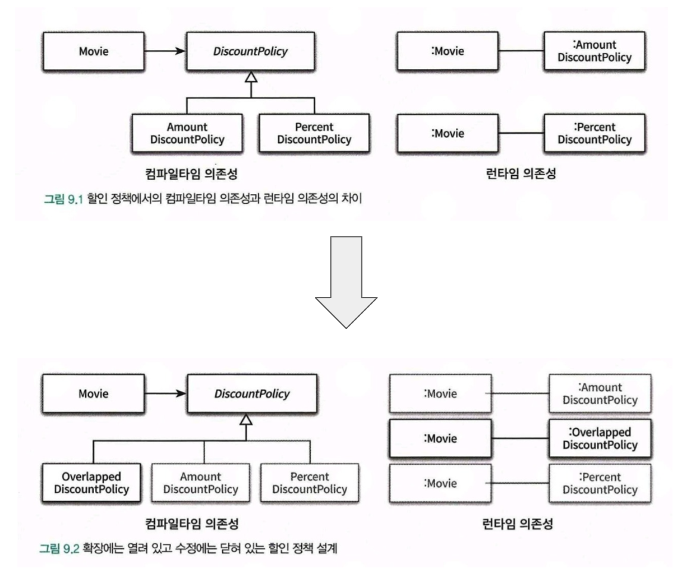
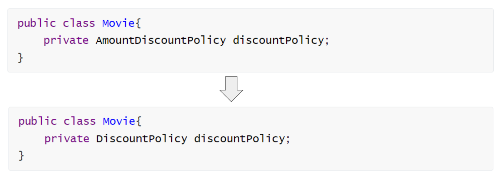

# 9. 유연한 설계
{: .no_toc }
<br>


## Table of contents
{: .no_toc .text-delta }

1. TOC
{:toc}

---

<br>

### 참고자료
{: .fs-6 .fw-700 }
- [오브젝트](https://search.shopping.naver.com/book/catalog/32453230352?query=%EC%98%A4%EB%B8%8C%EC%A0%9D%ED%8A%B8%20%EC%A1%B0%EC%98%81%ED%98%B8&NaPm=ct=lgv4bbxs%7Cci=950866afa7fa493589cc2e1f6b8686ab9b67e091%7Ctr=boksl%7Csn=95694%7Chk=b2d3d1acd016fb57260c0abe8e3ce0a6ee8c22ca)
<br>

### 함께 생각해볼만한 자료
{: .fs-6 .fw-700 }
- [초식 - 의존방향 생각하기](https://www.youtube.com/watch?v=cPdB-UBAVn8)
<br>

### 01. 개방-폐쇄 법칙 (Open-Closed Principle, OCP)
{: .fs-6 .fw-700 }
<br>

#### OCP(Open-Closed Principle, OCP), 로버트 마틴
{: .fs-5 .fw-700 }

로버트 마틴은 확장 가능하고 변화에 유연하게 대응할 수 있는 설계를 만들 수 있는 원칙 중 하나로 개방 폐쇄 원칙(Open-Closed Principle, OCP)을 고안했다.
<br>

로버트 마틴이 이야기하는 OCP는 아래와 같다.
- 소프트웨어 개체(클래스, 모듈,함수 등등)는 확장에 대해 열려 있어야 하고, 수정에 대해서는 닫혀 있어야 한다.
<br>

개방 폐쇄 원칙 관점에서 유연한 설계라는 것은 기존의 코드를 수정하지 않고도(=수정에 닫혀있고) 애플리케이션의 동작을 확장할 수 있는 설계(=확장에는 열려있다.)를 의미한다
<br>

개방 폐쇄 원칙을 지키는 설계를 하다보면, 결과적으로는 일반적으로 아래의 원칙을 따르게 된다.
- 컴파일 타임 의존성을 고정시키고 런타임 의존성을 변경하라
- 추상화가 핵심이다.

<br>

#### 컴파일 타임 의존성을 고정시키고 런타임 의존성을 변경하라.
{: .fs-5 .fw-700 }

- 개방-폐쇄 원칙은 사실 런타임 의존성과 컴파일 의존성에 관한 이야기다.
- 런타임 의존성은 실행 시에 협력에 참여하는 객체들 사이의 관계다.
- 컴파일 타임 의존성은 코드에서 드러나는 클래스들 사이의 관계다.
- 개방-폐쇄 원칙을 지키는 코드는 컴파일 타임 의존성을 수정하지 않고도 런타임 의존성을 쉽게 변경할 수 있다.

<br>

#### e.g. 새로운 영화 할인 정책 추가시 OCP 원칙
{: .fs-5 .fw-700 }

새로운 영화 할인 정책으로 중복할인 정책인 "OverlappedDiscountPolicy" 를 추가하는 예를 들어보자.
<br>

새로운 할인 정책인 OverlappedDiscountPolicy 를 추가할 때 기존 코드를 수정하면 컴파일 의존성을 해치게 된다. 대신 DiscountPolicy 라는 타입으로 할인 정책을 주입받도록 하고, 런타임 의존성으로 OverlappedDiscountPolicy 객체를 생성해서 DiscountPolicy 에 바인딩해주면, 기존 코드(컴파일 의존성)은 수정하지 않으면서 런타임에 새로운 기능이 추가될 수 있게 된다.

<br>


#### 추상화가 핵심이다.
{: .fs-5 .fw-700 }

개방-폐쇄 원칙의 핵심은 **추상화에 의존**하는 것이다.
'추상화', '의존' 이 두 단어에 주목하자.
<br>

추상화란 핵심적인 부분만 남기고 불필요한 부분은 생략함으로써 복잡성을 극복하는 기법이다.
<br>

공통적인 부분은 문맥이 바뀌더라도 변하지 않아야 한다.
- 이렇게 **공통적인 부분**이라는 것은 **추상화**를 의미한다.
- 이렇게 **추상화로 분류한 부분은 수정에 대해 닫혀 있어야** 한다.
<br>

이렇게 추상화를 통해 생략된 부분은 확장의 여지를 남긴다. 이렇게 확장의 여지를 남기는 것을 통해 개방-폐쇄 원칙을 가능하게 만들어준다.

<br>

#### 변하지 않는 부분 vs 변하는 부분
{: .fs-5 .fw-700 }

> 참고
> - [DiscountCondition](https://github.com/eternity-oop/object/blob/master/chapter09/src/main/java/org/eternity/movie/step01/DiscountCondition.java)
> - [DiscountPolicy](https://github.com/eternity-oop/object/blob/master/chapter09/src/main/java/org/eternity/movie/step01/DiscountPolicy.java)

<br>

`(1)` : 변하지 않는 부분
- 아래 코드에서 할인 여부를 판단하는 로직이다.
- `isSatisfiedBy(Screening)` 은 어디에서든 공통으로 쓰여야 한다.
- `isSatisfiedBy(Screening)` 을 추상화된 클래스로 분류해 수정에 닫혀있도록 해주었다.
- PeriodCondition, SequenceCondition 클래스는 [DiscountCondition](https://github.com/eternity-oop/object/blob/master/chapter09/src/main/java/org/eternity/movie/step01/DiscountCondition.java) 이라는 interface의 구현체(implement)다.
<br>

`(2)` : 변하는 부분
- 아래 코드에서 변하는 부분은 할인 요금을 계산하는 방법이다.
- [DiscountPolicy](https://github.com/eternity-oop/object/blob/master/chapter09/src/main/java/org/eternity/movie/step01/DiscountPolicy.java) 를 상속해서 생략된 부분을 오버라이딩(구체화)하면 할인 정책을 확장할 수 있게 된다.
- [DiscountPolicy](https://github.com/eternity-oop/object/blob/master/chapter09/src/main/java/org/eternity/movie/step01/DiscountPolicy.java) 를 확장하는 클래스인 AmountDiscountPolicy, PercentDiscountPolicy, NoDiscountPolicy 는 각각 getDiscountAmount(Screening) 에 대한 구현 부분이 각각 다르다.
- 즉, AmountDiscountPolicy, PercentDiscountPolicy, NoDiscountPolicy 는 각각 할인 요금을 계산하는 방법이 다르다.
<br>

```java
package org.eternity.movie.step01;

import org.eternity.money.Money;

import java.util.ArrayList;
import java.util.Arrays;
import java.util.List;

public abstract class DiscountPolicy {
    private List<DiscountCondition> conditions = new ArrayList<>();

    public DiscountPolicy(DiscountCondition ... conditions) {
        this.conditions = Arrays.asList(conditions);
    }

    public Money calculateDiscountAmount(Screening screening) {
        for(DiscountCondition each : conditions) {
			// 변하지 않는 부분 : 할인 여부를 판단하는 로직
            if (each.isSatisfiedBy(screening)) { // -- (1)
                return getDiscountAmount(screening);
            }
        }

        return screening.getMovieFee();
    }

	// 변하는 부분 : 할인 요금을 계산하는 방법
	// -- (2)
    abstract protected Money getDiscountAmount(Screening Screening);
}
```
<br>

### 02. 생성, 사용 분리
{: .fs-6 .fw-700 }
<br>

#### 객체 생성과 객체 사용로직이 혼재하는 것의 문제점
{: .fs-5 .fw-700 }

객체 생성 역시 개방 폐쇄 원칙을 위배하게끔 한다. 객체 생성을 하는 로직은 수정사항 발생시 동작의 추가 변경을 발생시킨다.
특히 **클래스 내에서 다른 객체를 생성하는 코드**는 **해당 객체에 대한 지식을 요구하기에 결합도를 높이는 요인이 되기도 한다**.

이렇게 **객체를 생성하는 부분을 분리**하는 보편적인 방법은 **객체 생성에 대한 책임을 클라이언트 역할을 하는 별도의 클래스 내의 메서드로 따로 옮기는 것**이다.

<br>


#### 객체 생성 로직을 일반 코드에서 분리하는 일반적인 방법들
{: .fs-5 .fw-700 }

객체 생성 로직은 아래와 같은 클래스/메서드에 따로 분리해두면, 개방/폐쇄 원칙을 지킬 수 있게 된다.

- 클라이언트 역할의 클래스
- Factory 클래스
- 순수한 가공물 (Pure Fabrication)

<br>

### 03. 의존성 주입
{: .fs-6 .fw-700 }
<br>

#### 의존성 주입
{: .fs-5 .fw-700 }

객체의 생성과 객체의 사용을 분리하고 나면 인스턴스를 사용하는 책임만 남겨지게 된다. 
즉, 인스턴스를 사용하는 로직만 남겨지게 된다.
사용하려고 하는 인스턴스는 객체의 외부에서 생성해서 전달해줘야 사용이 가능한데, 이렇게 객체를 외부에서 생성해서 전달해주는 방식을 의존성 주입이라고 한다.
<br>

괜히 개념이 조금 어렵게 느껴질수도 있겠다.
흔히 메서드 파라미터로 원하는 객채를 명시하고 외부에서 사용시에 해당 객체에 대한 구현체를 주입하는 것도 일종의 의존성 주입이다.
getter, setter, 생성자 주입만을 떠올릴 수 있지만, 테스트가 가능한 코드를 작성하다보면 메서드의 파라미터로 객체를 지정하는 경우가 많다. 이런 경우도 의존성 주입을 하는 하나의 예다.
<br>

이렇게 생성자 주입이든, getter/setter 주입이든, 메서드 주입이든 외부의 독립적인 객체로부터 인스턴스를 생성한 후 이를 전달해서 의존성을 해결하는 방식을 의존성 주입(Dependency Injection)[Fowler04]이라고 부른다.
<br>

> 참고...
> - 스프링의 의존성 주입은 프레임워크 레벨에서 Bean 을 찾아서 주입해주는 것을 의미한다.

<br>


#### 의존성 주입은 숨겨진 의존성의 단점을 해결할 수 있다.
{: .fs-5 .fw-700 }

- 의존성을 이해하기 위해 다른 코드의 내부를 읽을 필요가 없다. 따라서 캡슐화를 이룰 수 있고, 객체의 캡슐을 단단하게 보호한다.
	객체 생성을 위해 필요한 인자값, 객체 생성시 수행하는 객체 내부의 동작 등

- 의존성과 관련된 문제를 최대한 컴파일 타임에 잡아낼 수 있다.

- 필요한 의존성을 인자에 추가하지 않으면 컴파일 타임에 에러가 발생하기 때문

<br>


#### 요약
{: .fs-5 .fw-700 }

**의존성 주입이란?**<br>
외부에서 의존성을 해결하고, 이것을 사용하는 객체에 주입하는 동작을 의미

<br>

**3가지 의존성 주입 방식**<br>
- 생성자 주입 : 객체를 생성하는 시점에 생성자를 통해 의존성 해결
- setter 주입 : 객체 생성 후 setter 메서드를 호출해 의존성 해결
- 메서드 주입 : 메서드 실행 시 인자를 이용해 의존성 해결

<br>

e.g. 생성자 주입
```java
Movie avatar = new Movie("아바타",
					Duration.ofMillis(120),
					Money.wons(10000),
					new AmountDiscountPolicy(...)
				);
```
<br>


### 04. 의존성 역전 (Dependency Inversion Principle, DIP, 로버트 마틴)[Martin02]
{: .fs-6 .fw-700 }
<br>

의존성 역전 원칙(로버트 마틴)
- 상위 수준의 모듈은 하위 수준의 모듈에 의존해서는 안된다. 둘 모두 추상화에 의존해야 한다.
- 추상화는 구체적인 사항에 의존해서는 안된다. 구체적인 사항은 추상화에 의존해야 한다.

<br>

