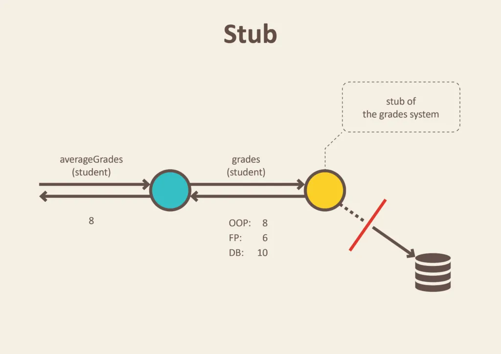
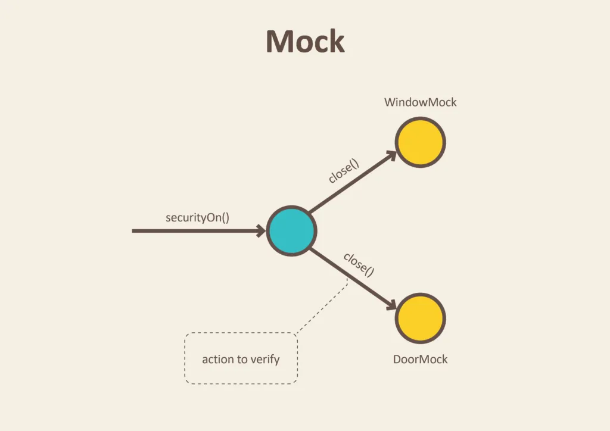
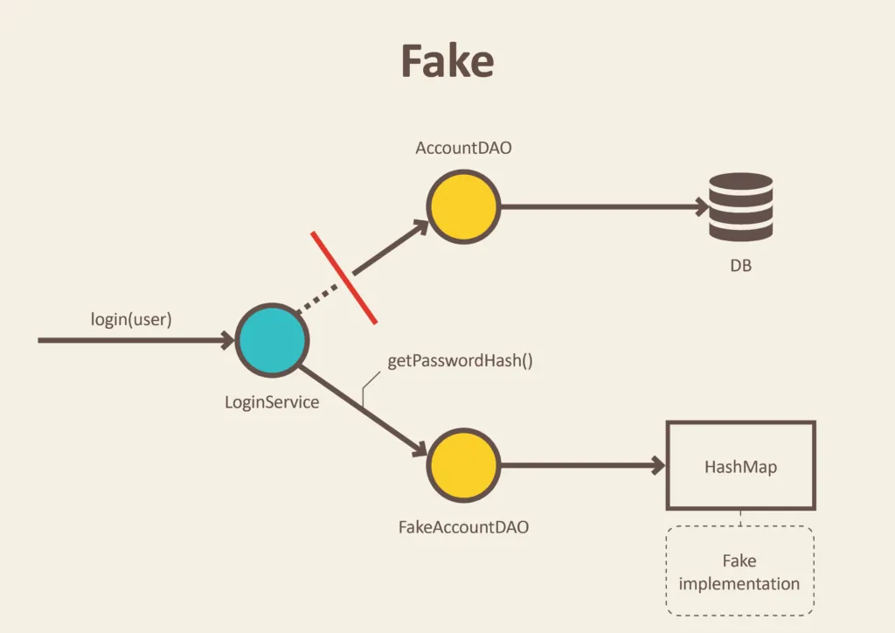

# Stub, Spy, Mock vs Dummy, Fake
{: .no_toc }
 
테스트를 진행하거나, 여기 저기 공통적으로 산재된 코드를 리팩토링할 때 가짜 객체의 종류들을 미리 공부해둔 다면, 용어적으로도 명확히 범위가 구분되고 종류를 구분할 수 있기 때문에 Dummy, Stub, Fake, Spy, Mock 을 파악해둔다면 좋다. 
 

## Table of contents
{: .no_toc .text-delta }

1. TOC
{:toc}

---

 

### 참고자료
{: .fs-6 .fw-700 }

- [Test Doubles (테스트 더블) - Dummy, Fakes, Mocks, Spy and Stubs](https://codinghack.tistory.com/92)
- [Test Doubles - Fakes, Mocks and Stubs](https://blog.pragmatists.com/test-doubles-fakes-mocks-and-stubs-1a7491dfa3da)

 

### Fake 객체, 대역, Stub 이란?
{: .fs-6 .fw-700 }
 
테스트 코드 작성시 실제 객체가 아닌 단순한 객체를 이용해 어떤 동작을 하게끔 해서 결과값이나 동작을 테스트 하는 경우가 많다. 
이런 경우 Fake 객체를 사용하거나 대역을 수행하는 객체를 도입한다.
- Fake 객체
  - 어떤 하나의 동작을 수행하는 하나의 클래스를 테스트용도로 정의해서 사용하는 것을 의미한다.
- 대역
  - `이런 이런 조건에서는 이렇게 대답한다` 라는 대사를 기억하는 **대역**을 수행하는 도입하는데, 이것을 실제 하나의 타입으로 정의해서 테스트를 만드는 경우도 있고 Mockito 와 같은 프레임워크를 통해 하나의 표현식으로 만들어서 테스트를 만드는 경우도 있다.
  - 대역이 하는 **대사** 를 stub 이라고 이야기한다.
 
 

### 테스트 더블이란?
{: .fs-6 .fw-700 }
- 가짜 객체 또는 대역 객체를 이용해 테스트하는 것을 `Test Double` 이라고 부른다.
- 제라드 메스자로스(Gerard Meszaros)가 만든 용어다.
 

 

### Stub, Mock, Dummy, Fake
{: .fs-6 .fw-700 }
Stub, Mock, Dummy, Fake 모두 테스트를 위한 객체를 만드는 것을 의미한다. 
 

**Mock, Stub** 

Stub 은 하나의 실제 행위를 테스트 하기 위해 실제 객체를 대체하면서 **어떻게 연기할지** 를 정의하는 것을 의미한다. Mock 은 Stub을 하기 위해 사용하는 가짜 객체를 의미하는데, Mock 객체를 기반으로 Stub을 하는 것은 꽤 흔하게 자주 사용되는 편이다. Stub은 대역이 하는 대사를 의미한다. 따라서 Mock 객체로 Stub 을 한다는 것은 Mock 객체로 어떤 연기를 한다는 것을 의미한다.
> 내가 생성한 Mock 객체는 이런 상황에서 이런 출력을 낼거야. 나머지 테스트 코드는 이 상황 안에서 작성해.. 등과 같은 방식으로 테스트 코드를 작성한다.
 

이렇게 Stub을 수행하는 객체는 Mock 기반의 가짜객체가 있을 수도 있겠지만 `Stub-` 이라는 접두사를 붙인 하나의 클래스/타입으로 만들어서 테스트 상황(요건)을 정형화해두기도 한다. 
Stub 클래스와 Mock 객체의 차이점을 정리해봤다. 
뭔가 길어보이지만 짧게 이야기하면 `Stub-` 클래스를 정의한다는 것은 테스트 상황/전제조건을 클래스로 직접 정의해둔 것이고 Mock 기반의 가정구문을 작성한 것은 테스트 상황/전제조건을 표현식 기반으로 작성한다는 것을 의미한다. 
 

- Stub 클래스
  - Dummy 데이터 기반으로 동작하게 만든 객체
  - Stub 을 테스트 코드에서 사용하는 방식은 **클래스 기반의 Stub**, **가짜 객체 기반의 Stub 표현식**이 있다.
  - **클래스 기반의 Stub, 가짜 객체 기반의 Stub 표현식**은 글의 아래에 별도로 정리해두었다.
  - 주로 실제 클래스를 상속받은 후 테스트하려는 메서드를 오버라이딩 하기도 한다.
- Mock
  - 가짜 객체를 만드는 것을 의미한다.
  - 가짜 객체를 만들어서 표현식 기반으로 Stub 하는 것 역시 가능하다. 
  - 예를 들면 Mockito 프레임워크를 사용해서 Stub을 하면, Stub을 표현식 기반으로 하는 것이 된다.
  - 테스트 케이스가 비즈니스 적으로 확립된 요건이라면 여기 저기 산발되는 테스트 코드의 재사용성을 위해 `Stub-` 클래스를 정의해두기도 한다. 
    - (개별 테스트 요건/전제조건을 일일이 개별 테스트 클래스를 찾아서 모키토 구문을 확인하는 것이 비생산적인 순간은 언제든지 올 수 있기 때문이다.)

 

**Dummy** 

Dummy 는 테스트를 위한 데이터를 의미하기도 하고, 테스트를 위한 가짜 동작을 하는 Dummy 클래스를 만드는 것 역시 Dummy를 의미한다. Stub, Mock 모두 대역이여서 실제 객체를 연기하는 역할을 하는데, Dummy 는 Stub, Mock 이 하는 대역의 역할과, Spy 처럼 실제 객체의 인자 호출 타입/값, 호출횟수 등을 감시하는 것들을 포함하는 광범위한 개념이다.

 

**Fake** 

Fake 는 완전하게 개별적인 클래스를 의미한다. 대역을 통해 어떤 역할을 가정한다기 보다는, 그 클래스/객체를 대체하는 경우를 의미한다. 예를 들면 RedisRepository 를 상속(확장)하는 FakeRedisRepository 를 테스트 코드에서 사용하는 것을 예로 들 수 있다. 

만약, 테스트 코드에서 테스트 시 마다 네트워크를 통해 레디스에 접속하고, 레디스의 키/밸류가 여러 개발자에 의해 공유된다면, 테스트의 멱등성을 확보하기 쉽지 않다. 레디스 커넥션 테스트는 따로 하면 된다.  

레디스에서 특정 키에 대해 밸류의 값이 여러가지 종류일 경우 이 때마다 레디스의 키/밸류를 수정하기보다는, 순수 자바 코드 기반에서 특정 키에 대한 Value 의 종류에 따른 순수 자바 로직에 대한 테스트는 FakeRedisRepository 를 구현해서 테스트를 한다면, 테스트의 멱등성을 확보할 수 있게 된다.  

주로 FakeRedisRepository 같은 `Fake-` 라는이름의 클래스를 만들고, RedisRepository 라는 인터페이스를 통해 RedisRepository 라는 추상타입으로 분류해둔다. 

또는 [testcontainer](https://www.testcontainers.org/) 라는 격리된 docker 환경 내에서 테스트를 구동하는 경우 역시 생각해볼 수 있다. 

 

### 클래스 기반의 Stub, 가짜 객체 기반의 Stub 표현식
{: .fs-6 .fw-700 }
**클래스 기반의 Stub**
- 여러 곳에서 Stub 으로 작성한 코드들이 중복되면, 이 Stubbing, 즉, 가정을 하나의 코드로 구체화해서 모아두는 것에 대해 고려하게 된다.
- 여러 곳에 제 각각으로 흩어져있는 Mockito 의 stubbing 이 하나의 구체적인 비즈니스 요건으로 공통화가 가능하다면 클래스 기반으로 정의해두면, 재사용이 가능해진다.

**가짜 객체 기반의 Stub 표현식**
- 비즈니스 요건이 파악되고 공통점이 발견되기 전까지는 Mockito 같은 프레임워크에서 제공하는 가짜 객체 기반의 스터빙을 사용한 테스트를 사용하면 좋다.
 

### 실제 업무에서 경험
{: .fs-6 .fw-700 }
클래스 기반의 Stub 정의 경험
- 미국주식 소켓 데이터 수신 시 데이터 유형 분류
  - 실제로 경험해본 예로는 주식 거래 데이터 전송/저장 프로그램 구현 시에 미국주식의 개장/폐장/AFT/PRE 여부파악을 해야했고, 미국주식 말고도 중국,한국,베트남,채권,환율 데이터 를 연동했기에 어느 나라의 어느 시각의 어느 데이터인지 파악이 필요했었다. 써머타임 적용시에 대한 테스트 코드 역시 있어야 했었다. 개발서버나 로컬서버를 구동할 수 없는 환경이었다. 폐쇄망은 아니었지만, 개발 서버를 구축할 수 없는 환경이었다. 실제 거래 체결 데이터를 가짜로 제공해줄 정도로 레피니티브가 친절하지는 않았다. 물론 서비스가 커지고 나면 거래 로그를 NoSQL 기반으로 쌓는 용도의 인스턴스를 만들어서 서비스의 신뢰성을 높이려고 했었다. 다만, 스타트업이고 1인 개발체제인지라 1주일마다 몰려오는 배포일정, 기능추가일정에 머리가 아파서 일정이 조금씩 뒤로 밀렸던 것 같다.
  - 이때 여기 저기 여러가지 경우의 수에 대한 테스트 코드를 만들어야 했는데, Mockito 기반의 Stubbing 식은 세부 테스트 코드 안에 숨어있어서 뭔가 조건 값 가정을 수정할 때 일일이 찾아야 하는 피로감이 있었고, 이런 이유로 `Stub-` 이 붙은 별도의 테스트 클래스를 테스트 패키지 내에서만 작동하도록 정의해두어 테스트에 사용했었다.

- Mockito 를 사용했던 경험
  - 미국은 써머타임도 있고, 장중/PRE/AFT 등의 마켓타임이 따로 있을 뿐만 아니라 중국, 베트남, 한국 지수 주식을 따로 다루고 있었고 이 외에도 채권,환율,원자재 등을 같이 다루었기 때문에 시간판별 코드가 제대로 동작하는지를 파악하는 것이 필요했다.
  - 이것 역시 레피니티브에서 개발서버를 제공하는 것도 아니기에 테스트코드 기반으로 입력값에 대해 입력된 값에 포함된 시간 데이터가 현지시각으로 장중인지 PRE/AFT 마켓인지 등을 미국/중국/베트남/한국 현지시각 기준으로 변환하는 로직을 검증해야 했다. 만약 개발서버가 있다고 하더라도 단순히 눈에서 확인하는 것에서 그치는 것이 아니라 상용 서비스에 배포하기 전에는 뭔가 확신이 필요했다. 테스트 코드가 있다면 클릭 한번으로 이런 단위 기능 로직을 검증할 수 있다. 그래서 이런 중요한 로직들은 단위 기능으로 분류해서 테스트가 가능한 함수로 만들어두었었다. 한국에 있는 개발실에서 미래에 들어올 수 있는 데이터에 대해 테스트 코드로 현지시각이 언제인지를 가정해서 단위 기능이 정확하게 동작함을 체크하는 테스트 코드였는데, 막상 적어보니 굉장히 거창해보이지만 머리를 쥐어짜서 만든 테스트 코드는 그렇게 길지 않다. 실무에서 테스트 코드를 작성하는 것은 거창한 그런 개념이라기 보다는 '일단 실천해보는 것' 이라는 생각이 든다.
 
 

### 일러스트
{: .fs-6 .fw-700 }
아래 그림들은 [Test Doubles - Fakes, Mocks and Stubs](https://blog.pragmatists.com/test-doubles-fakes-mocks-and-stubs-1a7491dfa3da) 에서 얻어왔다. 

 

#### stub
{: .fs-5 .fw-700 }

 

#### mock
{: .fs-5 .fw-700 }

 

#### Fake
{: .fs-5 .fw-700 }

